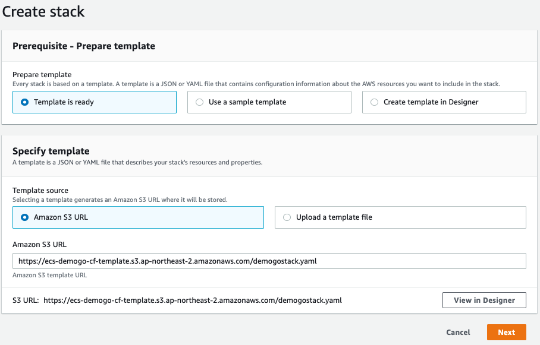
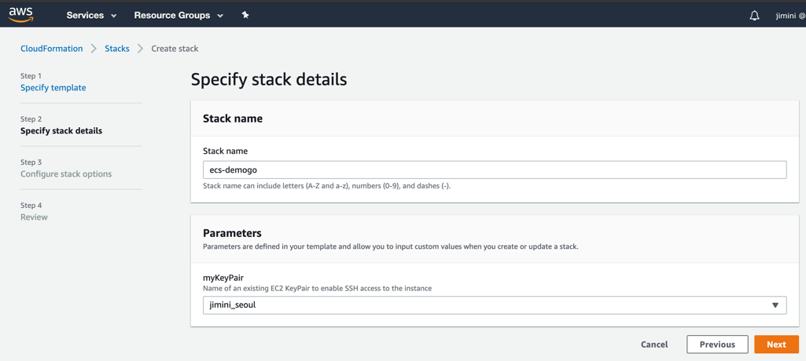
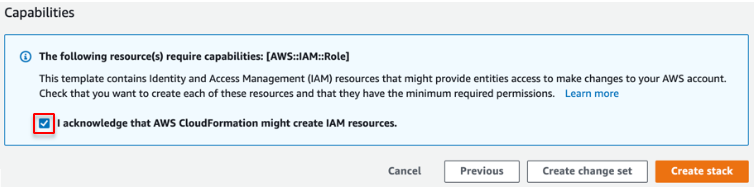
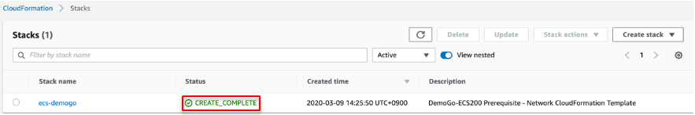

{}
You will deploy CloudFormation stack to create VPC environment, **Workstation** EC2 instance, IAM role, security groups and other prerequisites. 
{}

Click the [Launch Stack button](https://console.aws.amazon.com/cloudformation/home?region=ap-northeast-2#/stacks/new?stackName=ecs-demogo&templateURL=https://ecs-demogo-cf-template.s3.ap-northeast-2.amazonaws.com/demogostack.yaml).

{}
Important! You must choose **ap-northeast-2 (Seoul) region**.
{}

{}&nbsp;Launch Stack{}

1. You will be redirected to CloudFormation. 

2. Select your key pair. 

1. Skip **Configure stack options** and click **Next**.
2. Review and create - check **I acknowledge that AWS CloudFormation might create IAM resources** and click **Create stack.**

5. Wait till the stack status turned to **CREATE_COMPLETE**. It takes about 5 minutes.

