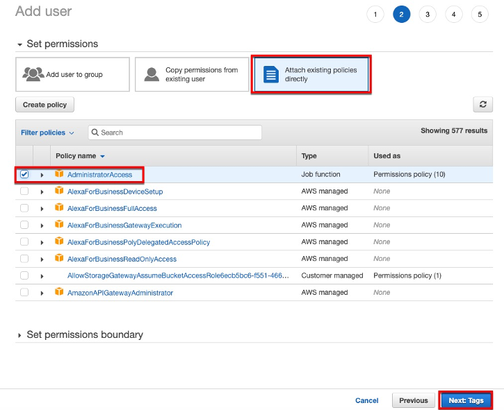

## AWS Account
{}
If you don’t already have an AWS account, please create one first.
{}

Find [here](https://aws.amazon.com/ko/premiumsupport/knowledge-center/create-and-activate-aws-account/) how to create and activate AWS account. 

{}
Choose **ap-northeast-2 (Seoul) region** for this workshop. You will deploy CloudFormation stack to create prerequisites in the next step. 
{}

## IAM User
Now you have your own AWS account and let's create an IAM user with Administrator access. Skip if you already have one. 

1.	Login to AWS account as **Root** user using your email address and password. 
1.	Move to [IAM](https://console.aws.amazon.com/iam/) **Users** and click **Add user**.
1.	**User name**: `Administrator`
1.	Check **AWS Management Console access**. Select **Custom password** and enter the password to use.  
1.	Click **Next: Permissions**.

1.	Select **Attach existing policies directly** and check **AdministratorAccess** policy. Click **Next: Tags**.

1.	Click **Next: Review**.
1.	Review if **Administrator** user has **AdministratorAccess** managed policy and click **Create user**. 
1.	Logout and log back in using **Administrator** userid. 
> `https://<your_aws_account_id>.signin.aws.amazon.com/console/`  
{}
<your_aws_account_id> is your own account's ID. 
{}

## EC2 Key Pair
If you already have EC2 key pair, skip to the next step. 
1. Move to [Amazon EC2](https://console.aws.amazon.com/ec2/) **Network & Security** and select **Key Pairs**.
1.	Click **Create Key Pair**. 
1.	**Key pair name**: your new key pair name. 
1. Click **Create**,
1.	Your private key (.PEM) will be automatically downloaded. You will use this key when you deploy CloudFormation stack in the next step. 
