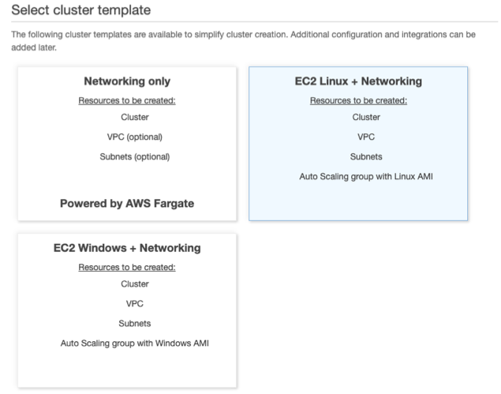
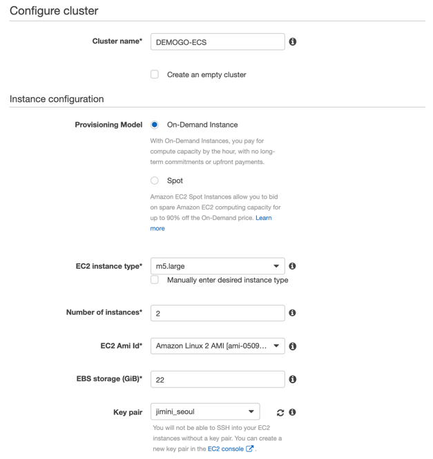
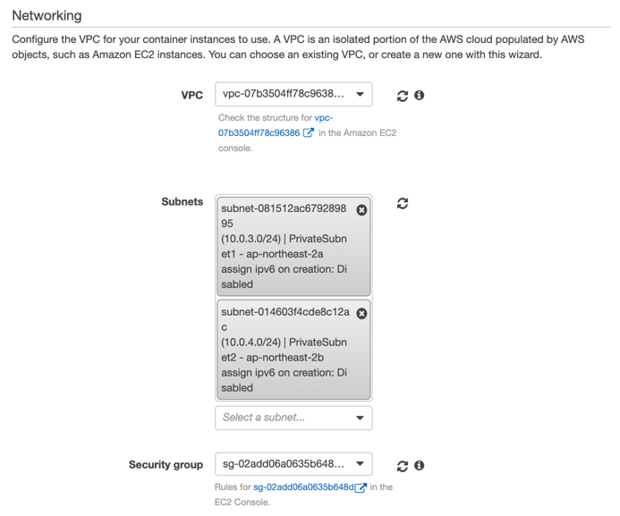
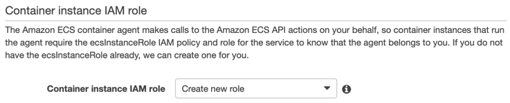
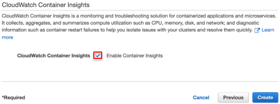

{}
 이번 챕터에서는 EC2 리눅스 클러스터 **DEMOGO-ECS**와 클러스터 인스턴스가 사용할 IAM 역할(role) **ecsInstanceRole**을 생성합니다.
{}

1. [Amazon ECS](https://console.aws.amazon.com/ecs)로 이동합니다. ECS를 이용하는게 처음이라면 *Get started* 화면이 보일 것입니다. 무시하고 Amazon ECS 좌측 네비게이터에서 Clusters로 이동합니다. **Create Cluster**를 클릭합니다. 

2)	Step 1: Select cluster template – **EC2 Linux + Networking**을 선택합니다. 

3)	Step 2: Configure cluster	

- Cluster name: `DEMOGO-ECS`
- Instance Configuration    
    + Provisioning model: On-Demand Instance
    + EC2 Instance type: m5.large
    + Number of instances: `2` 
    + EC2 AMI id: Amazon Linux 2 AMI
    + EBS storage: 22
    + Key pair: 키 파일을 선택합니다.  

4. Networking
+ VPC: **DemoGoECSVPC (10.0.0.0/16)**
+ Subnets: **Private subnet 1,2 (10.0.3.0/24, 10.0.4.0/24)**
+ Security Group: **DEMOGO-ECS-Instance**

5. Container instance IAM role: **Create new role**를 선택합니다. **ecsInstanceRole**라는 이름으로 자동 생성합니다. 

{}
이전에 **ecsInstanceRole**을 생성한 적이 있다면 **ecsInstanceRole**을 드롭다운에서 선택합니다. 다음 단계에서 권한을 추가로 부여할 것입니다. 만약 ecsInstanceRole 권한을 수정이 불가한 경우 실습용 IAM role을 따로 생성하여 진행합니다.
{}

6. CloudWatch Container Insights: **Enable Container Insights**를 체크하고 **Create**을 클릭합니다. 

