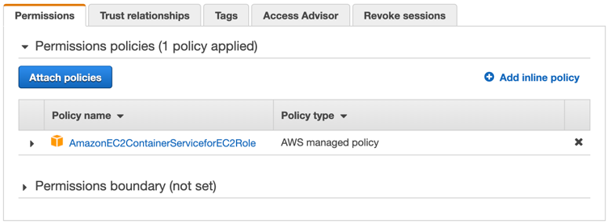
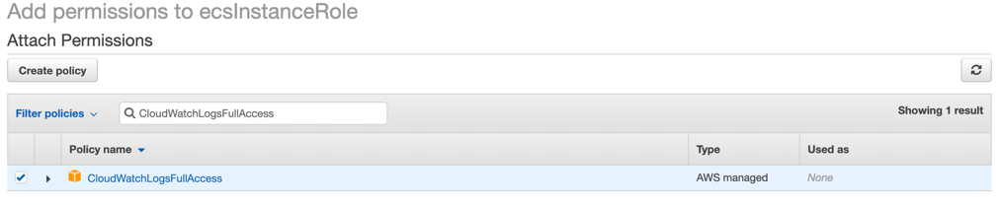
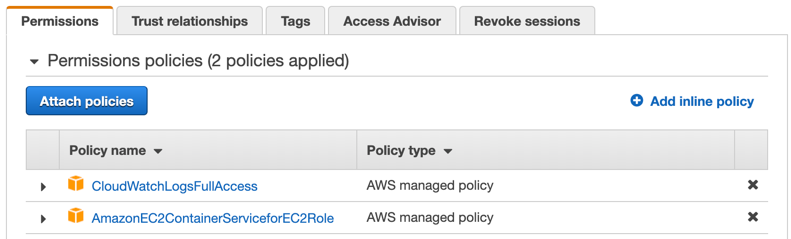

{}
ECS 인스턴스는 AWS FireLens를 통해 CloudWatch Logs로 컨테이너 로그를 송출하기 위해 액세스 권한이 필요합니다. 앞 단계에서 자동 생성한 ECS 인스턴스의 IAM 역할인 **ecsInstanceRole**에 **CloudWatchLogsFullAccess**를 추가합니다.
{}

### ECS 인스턴스 IAM Role에 권한 추가
1. [IAM](https://console.aws.amazon.com/iam) 역할(roles)로 이동합니다. 
1. `ecsInstancerole`를 검색합니다. (만약 기존의 다른 IAM 역할을 사용한 경우 그 역할 이름을 검색합니다.)
1. 해당 역할을 선택하고 **Attach policies**를 클릭합니다. 

1. **CloudWatchLogsFullAccess** 정책을 검색하고 선택합니다.  

1. **CloudWatchLogsFullAccess** 정책이 잘 추가되었는지 확인합니다. 
