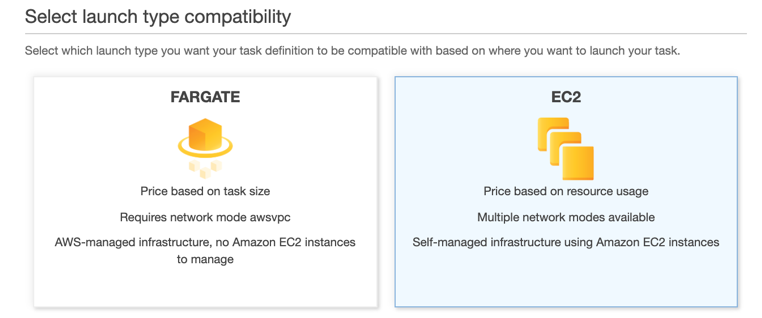
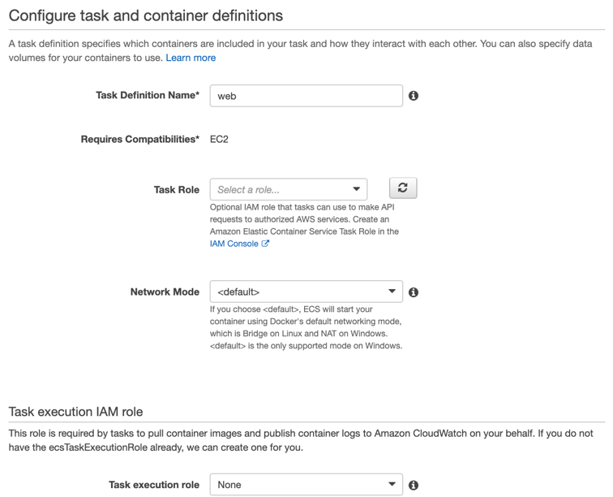
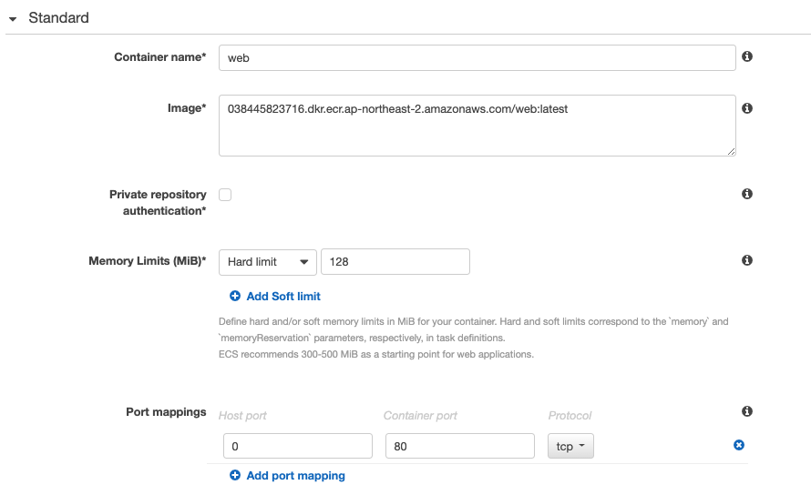

{}
**Web** task definition uses **EC2** launch type. The docker iamge which **web** uses is provided. Leave default unless specified. 
{}

### Create web task definition
1. Move to [Amazon ECS](https://console.aws.amazon.com/ecs) Task definition. Click  **Create new Task Definition**
2. Select launch type compatibility: **EC2** 

1. Task Definition Name: `web`

1. Scroll down to *Container Definitions* and click **Add container**.

1. Config **web** container.  

- Container name: `web`
- Image: `038445823716.dkr.ecr.ap-northeast-2.amazonaws.com/web:latest`
- Memory Limits - Hard limit 128
- Port mappings 
    + Host port: 0	
    + Container port: 80

6. Click **Add** in tne bottom right. The window closes.
2. Click **create**.