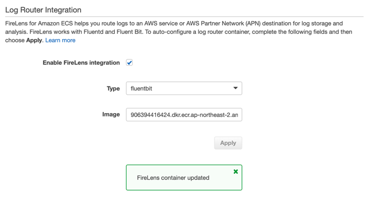
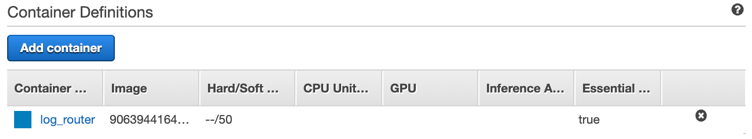
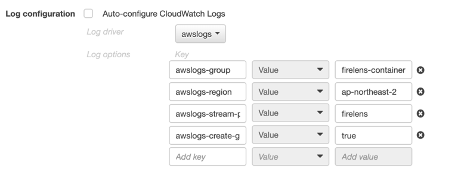
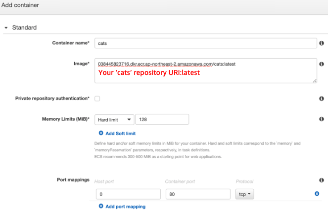
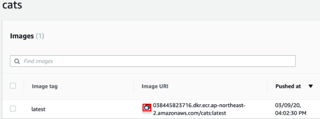
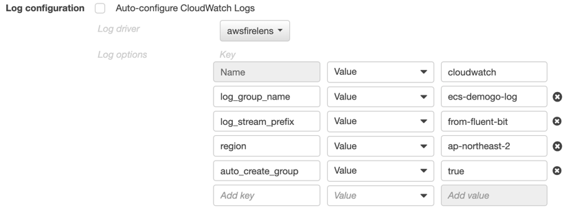

{}
You just created **web** task definition and the way to define **cats** task is almost same. The only difference with **cats** is to configure **FireLens**, which is a container log router for Amazon ECS to send logs to Amazon CloudWatch Logs. 
{}

## Create catsdef
1)	Move to [Amazon ECS](https://console.aws.amazon.com/ecs) Task definition to create new.  
2)	Select launch type compatibility: **EC2**  

3)	Task Definition Name: `catsdef`  

### Configure FireLens
#### Enable FireLens
4)	Scroll down to *Log Router Integration* and check *Enable Firelens Intigration.* Select **fluentbit** and click **Apply.**  

Scroll up to *Container Definitions* and check if **log_router** container was created. 

#### Log Configuration of log_router container
Click **log_router** container and scroll down to *Advanced container configuration – STORAGE AND LOGGING* to configure log. 
1. Log configuration: Uncheck **Auto-configure CloudWatch Logs**
2. Log driver and options:

- Log driver: **awslogs**
- Log options: Copy and paste is recommended.
  
|Key|Value|Input|
|------|---|---|
|awslogs-group|Value|`firelens-container`|
|awslogs-region|Value|`ap-northeast-2`|
|awslogs-stream-prefix|Value|`firelens`|
|`awslogs-create-group`|Value|`true`|

1. Scroll down to the end and click **Update**. 

### Add cats container
Come back to *Container Definitions* and click **Add container** to add **cats**.

1. Configure **cats** container. 
- Container name: `cats`
- Image: your **cats** latest image URI 

{}
Open new browser tab and move to ECR. Select **cats** repository and click the button of **latest** tagged image. 
{}

- Memory Limits - Hard limit 128
- Port mappings
    + Host port: 0
    + Container port: 80 (tcp)

#### Log Configuration of cats container
Scroll down to *Advanced container configuration – STORAGE AND LOGGING* and configure **cats** container logging.
1. Log configuration: Uncheck **Auto-configure Cloudwatch Logs.**
2. Log driver and options: 

- Log driver: awsfirelens
- Log options

|Key|Value|Input|
|------|---|---|
|Name|Value|`cloudwatch`|
|`log_group_name`|Value|`ecs-demogo-log`|
|`log_stream_prefix`|Value|`from-fluent-bit`|
|`region`|Value|`ap-northeast-2`|
|`auto_create_group`|Value|`true`|

1. Click **Add** then the window closes. Check if **cats** container added. 
2. Click **Create**. 