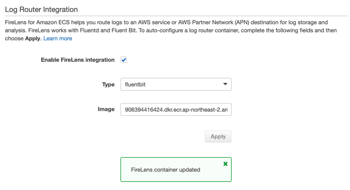
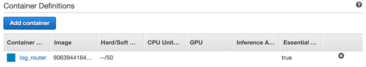
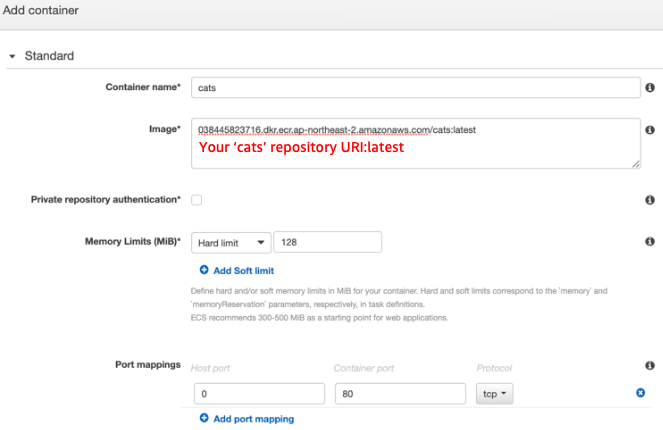
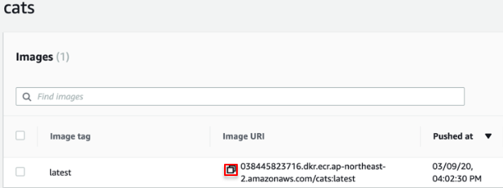
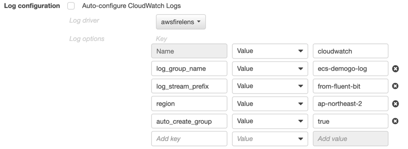

{}
Cats 작업 정의는 web과 마찬가지로 **EC2 타입**을 선택합니다. 추가로 로그 라우터인 **FireLens**를 활성화하여 **컨테이너 로그**를 Amazon CloudWatch Logs로 전송하도록 설정합니다.
{}

## catsdef 생성
1)	[Amazon ECS](https://console.aws.amazon.com/ecs) Task definition으로 이동하여 새 작업 정의를 생성합니다.  
2)	Select launch type compatibility: **EC2**를 선택합니다.  

3)	Task Definition Name: `catsdef`를 입력합니다.

### FireLens 구성
#### FireLens 활성화
*Log Router Integration*까지 스크롤을 내린 후 *Enable Firelens Intigration* 박스에 체크되어 있는지 확인합니다. **fluentbit** 타입을 선택하고 **Apply**를 클릭합니다. 

다시 *Container Definitions*로 돌아와서 **log_router**컨테이너가 생성된 것을 확인합니다.  

#### log_router 컨테이너의 로그 설정
**log_router** 컨테이너를 클릭하여 *Advanced container configuration – STORAGE AND LOGGING*에서 로그를 설정합니다.
1. Log configuration: **Auto-configure CloudWatch Logs**가 선택 해제되어 있는지 확인합니다. 
2. 다음과 같이 로그를 설정합니다.

- Log driver: **awslogs**
- Log options: 키/값을 다음과 같이 작성합니다. 정확한 설정을 위해 복사 및 붙여넣기를 권장합니다.  
  
|Key|Value|입력값|
|------|---|---|
|awslogs-group|Value|`firelens-container`|
|awslogs-region|Value|`ap-northeast-2`|
|awslogs-stream-prefix|Value|`firelens`|
|`awslogs-create-group`|Value|`true`|

3. 맨 하단에서 **Update**를 클릭하여 **log_router**의 설정을 마칩니다. 

### cats 컨테이너 추가
*Container Definitions*에서 **Add container**를 클릭하여 cats 컨테이너를 추가합니다.

1. cats 컨테이너를 다음과 같이 구성합니다. 
- Container name: `cats`
- Image: 실습자의 **cats** latest 이미지 URI 입력 

{}
브라우저에서 새 탭을 열어 ECR로 이동합니다. cats 리포지토리의 latest 태그된 이미지 URL 앞의 네모를 클릭하여 복사합니다. dogs도 동일한 작업을 수행해야 하므로 다음 단계까지 창을 열어둡니다. 
{}

- Memory Limits - Hard limit 128
- Port mappings
    + Host port: 0
    + Container port: 80 (tcp)

<!---9)	*Advanced container configuration – ENVIRONMENT*까지 스크롤을 내립니다.
 
- CPU Unit: 100 --->
#### cats 컨테이너 로그 설정
*Advanced container configuration – STORAGE AND LOGGING*에서 **cats** 컨테이너의 로그를 설정합니다.
1. Log configuration: **Auto-configure Cloudwatch Logs**가 선택 해제되어 있는지 확인합니다.
2. 다음과 같이 **cats** 컨테이너의 로그를 설정합니다. 

- Log driver: awsfirelens
- Log options

|Key|Value|입력값|
|------|---|---|
|Name|Value|`cloudwatch`|
|`log_group_name`|Value|`ecs-demogo-log`|
|`log_stream_prefix`|Value|`from-fluent-bit`|
|`region`|Value|`ap-northeast-2`|
|`auto_create_group`|Value|`true`|

3. **Add**를 누르면 창이 닫힙니다. cats 컨테이너가 추가된 것을 확인합니다.
4. **Create** 클릭하여 **catsdef** 생성을 마칩니다. 