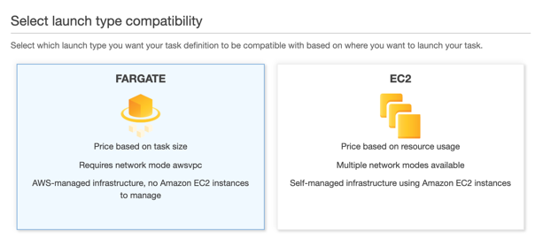
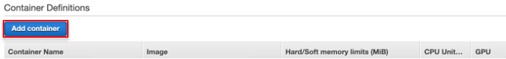

{}
Because **dogs** has **Fargate** launch type, not like **web** and **cats**, few options are different. For instance,  Amazon ECS task definitions for Fargate require that you specify CPU and memory at the task level. Amazon ECS tasks for Fargate require the awsvpc network mode, which provides each task with an elastic network interface. Find more on [Amazon ECS on AWS Fargate](https://docs.aws.amazon.com/ko_kr/AmazonECS/latest/developerguide/AWS_Fargate.html).
{}

### Create dogsdef
1. Move to [Amazon ECS](https://console.aws.amazon.com/ecs) Task definition and create new.
2. Select launch type compatibility: **Fargate**

3. Task Definition Name: `dogsdef`

4. Task size

- Task memory (GB): 0.5GB
- Task CPU (vCPU): 0.25 vCPU
5. Go to *Container Definitions* and click **Add container.** 

6. Configure **dogs** container.

- Container name: `dogs`
- Image: your **dogs** latest image URI 
    * Copy from the browser tab opening Amazon ECR. 

- Memory Limits: Soft limit 128
- Port mappings: Container port 80
7. Click **Add** then the window closes. Check if **dogs** container is added. 
8. Click **Create**. 