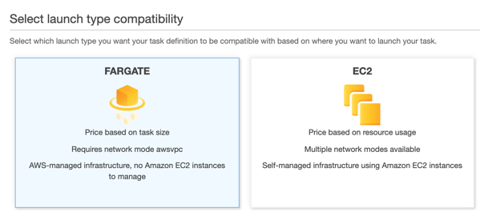
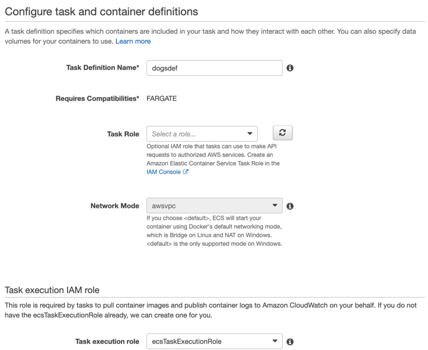
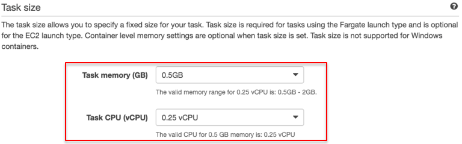
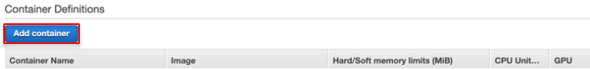
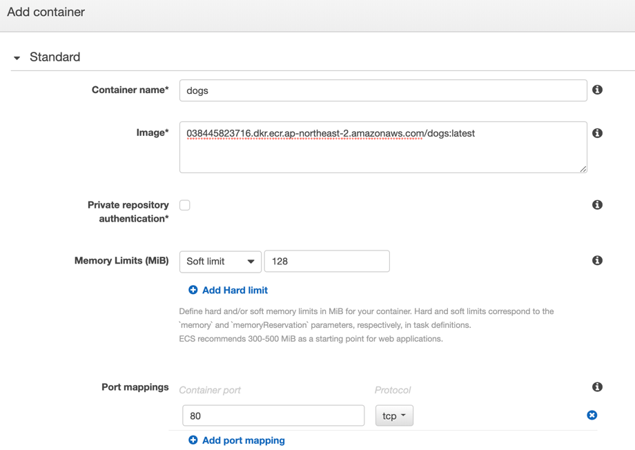
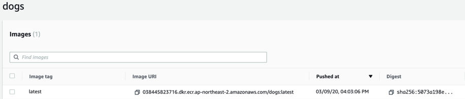

{}
**Dogs**는 **web, cats**와 달리 **Fargate** 시작 유형(launch type)을 사용하기 때문에 몇몇 설정 옵션에서 차이가 있습니다. 예를 들어, Amazon ECS의 Fargate 작업 정의(task definitions)는 태스크 수준에서 CPU와 메모리를 지정해야 합니다. Fargate 태스크는 awsvpc 네트워크 모드를 지정해야 하고 각 태스크별 ENI(Elastic Network Interface)를 부여합니다. AWS ECS on AWS Fargate에 대해 [더 알아봅니다.](https://docs.aws.amazon.com/ko_kr/AmazonECS/latest/developerguide/AWS_Fargate.html)
{}

### Dogs 작업 정의 생성하기
1. [Amazon ECS](https://console.aws.amazon.com/ecs) Task definition으로 이동하여 새 작업 정의를 생성합니다.  
2. Select launch type compatibility: **Fargate**를 선택합니다.

3. Task Definition Name: `dogsdef`를 입력합니다.

4. Task size

- Task memory (GB): 0.5GB
- Task CPU (vCPU): 0.25 vCPU

5. *Container Definitions*에서 dogs 컨테이너를 추가하기 위해 **Add container**를 클릭합니다. 

6. **dogs** 컨테이너를 설정합니다. 

- Container name: `dogs`
- Image: 실습자의 **dogs** latest 이미지 URI 
    * ECR를 열어둔 탭에서 복사합니다. 

- Memory Limits: Soft limit 128
- Port mappings: Container port 80
<!---1. *Advanced container configuration – ENVIRONMENT*까지 스크롤을 내립니다.
- CPU Unit: 100--->
7. **Add**를 누르면 창이 닫힙니다. **dogs** 컨테이너가 추가된 것을 확인합니다. 
8. **Create**을 클릭하여 **dogsdef** 생성을 마칩니다. 