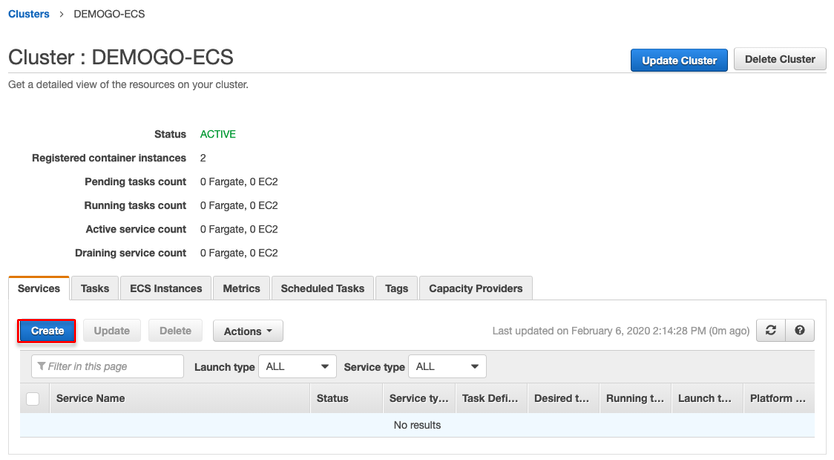
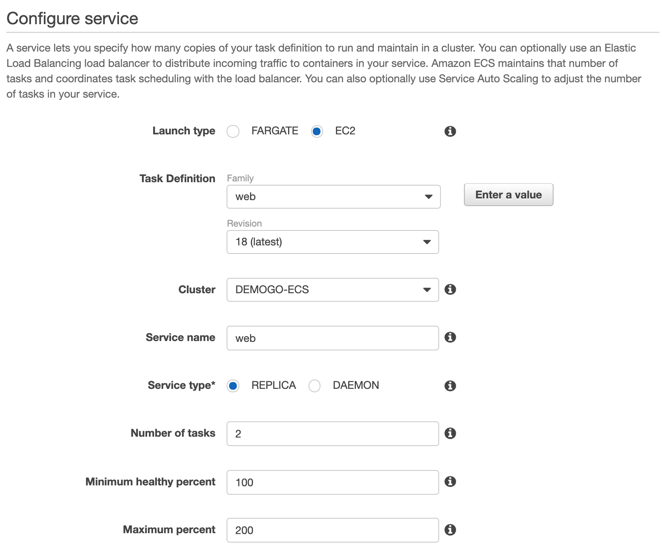
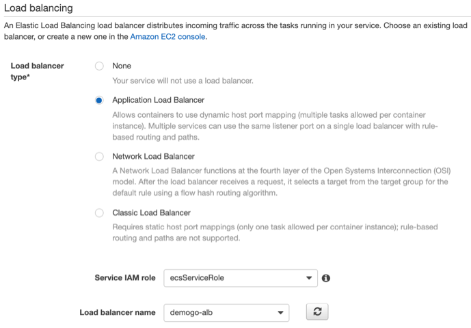
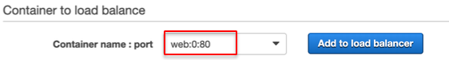
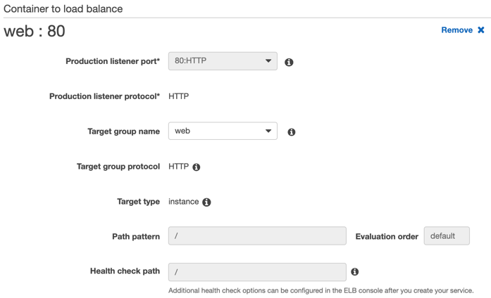
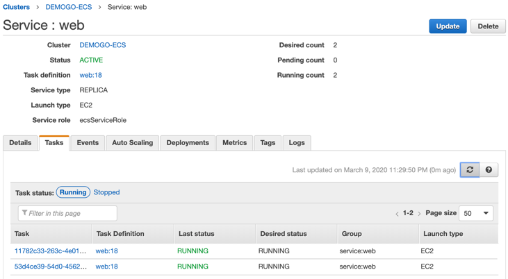

## Create service web 
1)	Move to [Amazon ECS](https://console.aws.amazon.com/ecs) and select **DEMOGO-ECS** cluster. Go to **Services** tab and click **Create**. Leave default to the rest options not mentioned.

2)	Step 1: Configure service 

- Launch type: EC2 
- Task Definition 
    - Family: **web**
    - Revision: **1 (latest)** (Revision number might be different. Choose the **latest**.) 
- Service name: `web`
- Number of tasks: `2`
- Task Placement: Select **AZ Balanced Spread** and click **Next step.**
3)	Step 2: Configure network

- Load balancing
    - Load balancer type: **Application Load Balancer** 
    - Service IAM role: **ecsServiceRole** (If you don’t have any, select **create new role.**)
    - Load balancer name: Select **demogo-alb**

- Container to load balance: Select **web:0:80** and click **Add to load balancer.**

- Production listener port: Select **80:HTTP** from the dropdown.
- Target group name: Select **web** from the dropdown then other options will be automatically filled. 

4)	Service discovery (optional) – **Uncheck** and click **Next**

5)	Set Auto Scaling: **Do not adjust the service's desired count**

{}
You will configure **service auto scale** in **6. Auto Scaling** later.
{}
6)	Review and create **web** service. 
7)	Click **View services** and check if **two** web tasks are **running**.
 