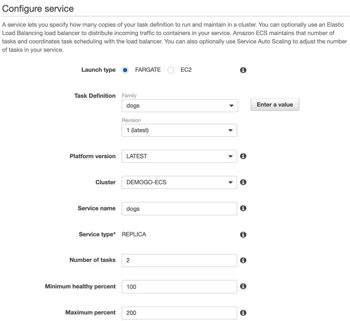
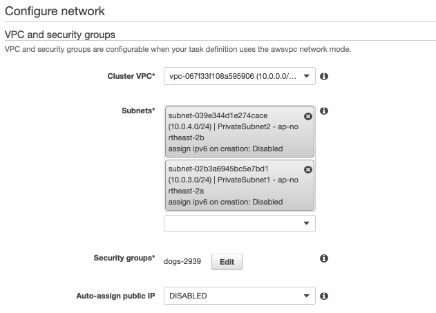
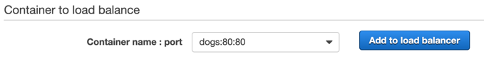
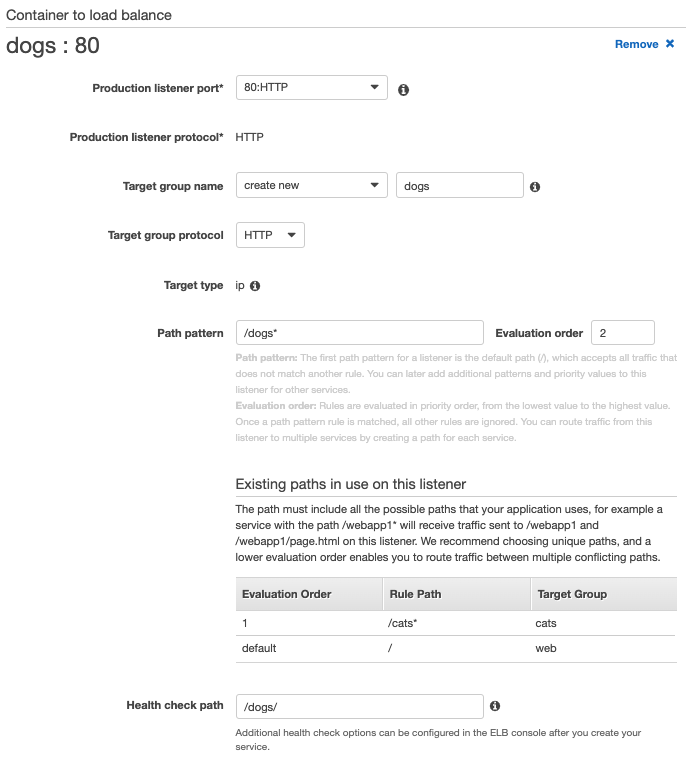
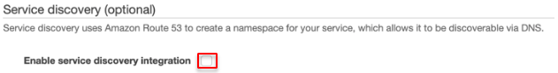
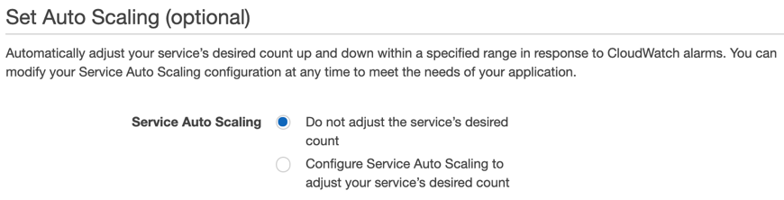

### Dogs 서비스 생성하기 
1) DEMOGO-ECS 클러스터의 **Services** 탭에서 **Create**을 클릭합니다. 
2)	Step 1: Configure service 

- Launch type: **Fargate**
- Task Definition 
Family: **dogsdef**
Revision: 1 **(latest)** 
- Service name: `dogs`
- Number of tasks: `2`
- Task Placement: **AZ Balanced Spread**
3. **Next step**을 클릭합니다.
4. Configure network

- Cluster VPC: **10.0.0.0/16 (DemoGoECSVPC)**
- Subnets: **PrivateSubnet1**(10.0.3.0/24)과 **PrivateSubnet2**(10.0.4.0/24)을 선택합니다.
- Security Group: 자동으로 새로 생성합니다.
- Auto-assgin public IP: **DISABLED**
1. Load balancer type으로 **Application Load Balancer**을 선택합니다.
2. Container name: **dogs:80:80**이 선택된 상태에서 **Add to load balancer**를 클릭합니다. 

7. **Container to load balance**를 설정합니다.

- Production Listener port: **80:HTTP**를 선택합니다.
- Target group name: **create new**를 선택하고 `dogs`를 입력합니다.
- path pattern: /dogs*, Evaluation order: `2`
- Health check path: `/dogs/`
1. Service discovery: 선택 **해제**합니다.

9. Set Auto Scaling: **Do not adjust the service's desired count**를 선택합니다.

10.	Review: 검토 후 **dogs** 서비스를 생성합니다. 