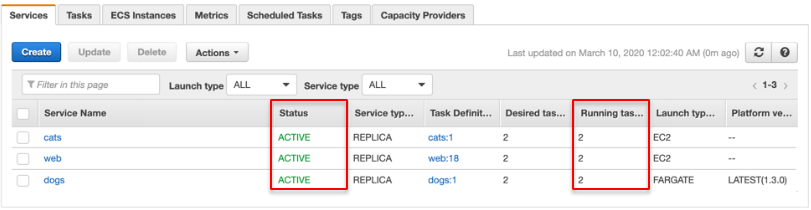
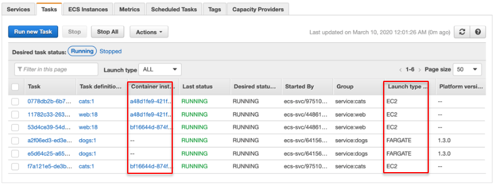
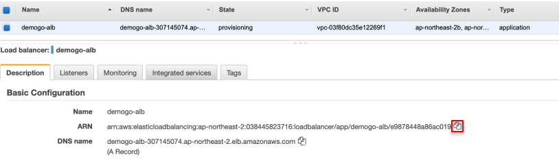

1. ECS **DEMOGO-ECS** 클러스터의 각 서비스가 **ACTIVE** 상태인지, **Running task**를 **2개씩** 가지고 있는지 확인합니다. 

1. **Tasks** 탭에서 각 태스크의 상태가 **RUNNING**인지 확인하고 **Container instance**를 살펴봅니다. 시작 유형(Launch Types)은 설정한 대로 EC2와 FARGATE가 혼합되어 있습니다. FARGATE 유형인 dogs 서비스는 Container instance 정보가 없는 것을 알 수 있습니다. 

1. [Amazon EC2 Load Balancers](https://ap-northeast-2.console.aws.amazon.com/ec2/v2/home?region=ap-northeast-2#LoadBalancers:)로 이동합니다. **demogo-alb**의 **DNS Name**을 복사하여 웹브라우저에 붙여 넣으면 **Web** 메인 페이지로 이동합니다.

4. **I♥Cats**와 **I♥Dogs** 배너를 각각 클릭해보세요. **멋진 친구들이 당신을 기다리고 있습니다!**

{}
축하합니다! 이렇게 단 하나의 서버도 구성하거나 관리, 패치, 리부팅할 필요 없이 Amazon ECS에서 간단한 컨테이너 애플리케이션을 배포했습니다.
{}
 