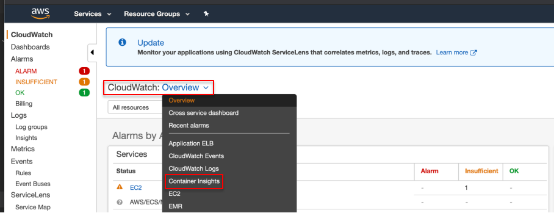
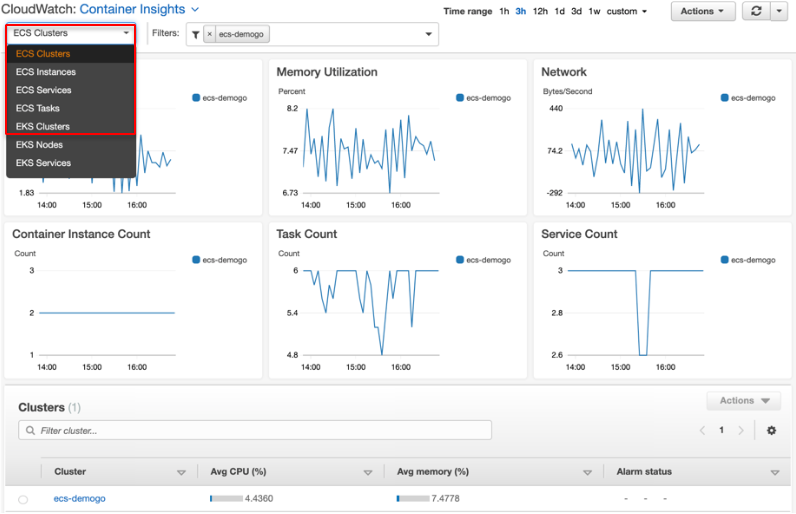
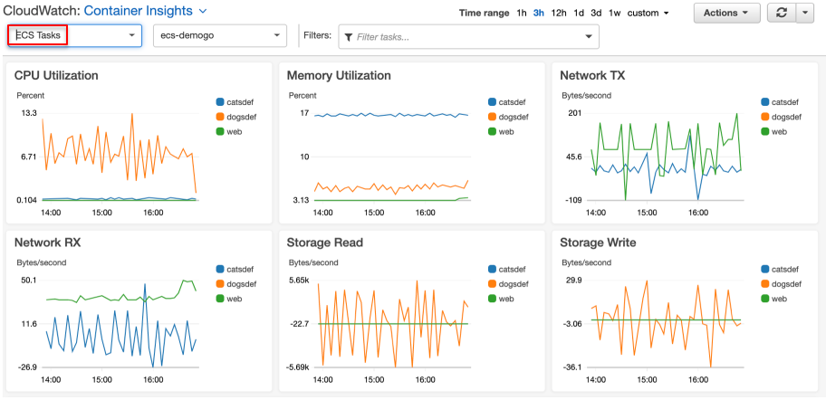
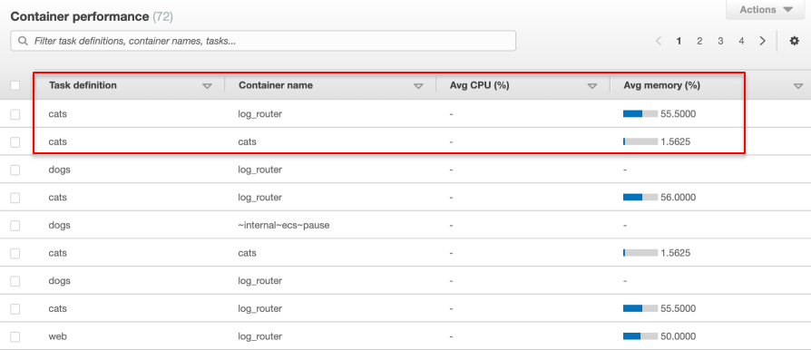

{}
CloudWatch Container Insights collects, aggregates, and summarizes metrics and logs from your containerized applications and microservices. The metrics include utilization for resources such as CPU, memory, disk, and network. Container Insights also provides diagnostic information, such as container restart failures, to help you isolate issues and resolve them quickly. 
{}
<!---You can also set CloudWatch alarms on metrics that Container Insights collects.--->

### Monitoring Amazon ECS with Container Insights
1.	Move to [Amazon CloudWatch.](https://console.aws.amazon.com/cloudwatch)
2.	Select **Container Insights**. You can view the metrics on the CloudWatch automatic dashboards.

3.	Navigate **ECS Clusters, ECS Services**, and **ECS Tasks.** Find more about [Container Insights metrics on ECS.](https://docs.aws.amazon.com/ko_kr/AmazonCloudWatch/latest/monitoring/Container-Insights-metrics-ECS.html)

1. Container Insights not only collects your ECS cluster metrics but also gathers tasks’. You can monitor at once which tasks consumes your cluster resources such as CPU, memory, network and storage. You can filter the tasks you would like to monitor. 

1. A single task definition has more than one container in many cases. You have itemized metrics **per container.** 

