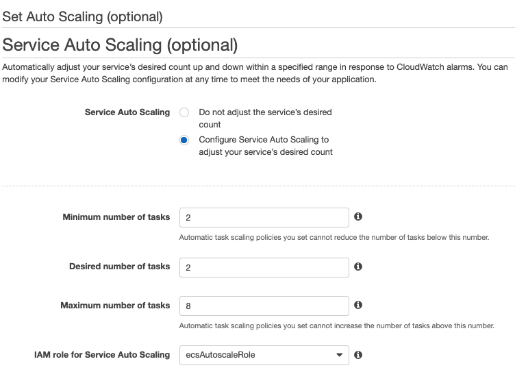

1. [Amazon ECS](https://console.aws.amazon.com/ecs) **DEMOGO-ECS** 클러스터로 이동합니다. 
2. **서비스** 탭에서 **web**을 선택하고 **Update**를 클릭합니다.

3. Step 1: Configure service - **다음 단계로 넘어갑니다.**
4. Step 2: Configure network - **다음 단계로 넘어갑니다.**
5. Step 3: Set Auto Scaling
Service Auto Scaling: **Configure Service Auto Scaling to adjust your service's desired count**을 선택합니다.
* Minimum number of tasks: `2`
* Maximum number of tasks: `8` 

1. Automatic task scaling policies – **Add scaling policy**를 클릭합니다.
2. **Add policy**를 설정합니다. 

* Scaling policy type: **Target tracking**
* Policy name: `ALB-request-tracking`
* ECS service metric: **ALBRequestCountPerTarget**
{}
각 ECS service metric을 선택할 때마다 최근의 추이를 참고할 수 있도록 그래프를 그려줍니다.
{}
* Target value: `4000` 
* Scale-out cooldown period: `10` seconds 
{}
본 실습에서는 빠른 결과 확인을 위해 의도적으로 낮은 임계치를 설정합니다. 
{}

8. **Next step**으로 넘어가 **Update Service**를 클릭합니다.

