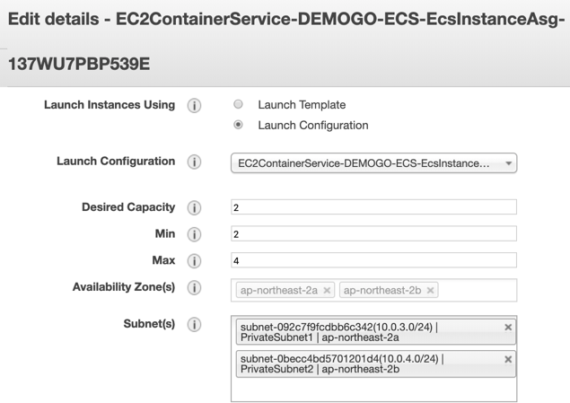

1)	[Amazon EC2 Auto Scaling Groups](https://ap-northeast-2.console.aws.amazon.com/ec2/autoscaling/home?region=ap-northeast-2#AutoScalingGroups:view=details)으로 이동합니다.

2)	*EC2ContainerService-DEMOGO-ECS-EcsInstanceAsg*을 선택하고 **Scaling Policies** 탭을 열어 **Add policy**를 클릭합니다.

3)	조정 정책을 설정합니다. 

* Name: `cluster-as-policy`
* Metric type: Average Network In (Bytes)
* Target value: `50000`
* Instances need: `10` seconds 

{}
본 실습에서는 빠른 결과 확인을 위해 의도적으로 낮은 임계치를 설정합니다. 
{}

1. **Create**을 클릭합니다.
2. *EC2ContainerService-DEMOGO-ECS-EcsInstanceAsg*을 선택하고 **Actions**를 눌러 **Edit**을 선택합니다. 

1.	ASG를 설정합니다. 그 외 설정은 기본값으로 남겨둡니다.  
    * Min: `2`
    * Max: `4`
    * default cooldown: `10` 

1.	**Save**를 클릭합니다.