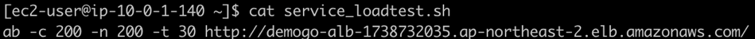

{}
SSH to your **Workstation** instance and create a shell script to perform load test on your service **web.**
{}

1. SSH to your **Workstation** EC2 instance. 
~~~
$ ssh -i [key pair name.pem] ec2-user@[Workstation Public IP]
~~~

2. Use linux *cat* command to read **service_loadtest.sh** example. 

3. Create **service_loadtest_YourName.sh** using vi editor. You need your **demogo-alb** DNS name. Move to [EC2 Load Balancers.](https://ap-northeast-2.console.aws.amazon.com/ec2/v2/home?region=ap-northeast-2#LoadBalancers:sort=loadBalancerName) Paste it on your notepad. 

~~~
$ vi service_loadtest_[Your Name].sh
~~~

~~~
ab -c 200 -n 200 -t 30 [Your ALB DNS name] + / 
~~~

* Remember **web** service has the default path /.)
* Type :wq! to finish editing. 

4.	Change the permission and run **service_loadtest_YourName.sh** script in serial for three minutes. Monitor the status in the next step.

~~~
$ chmod 755 service_loadtest_[Your Name].sh
~~~

~~~
$ ./service_loadtest_[Your Name].sh
~~~
