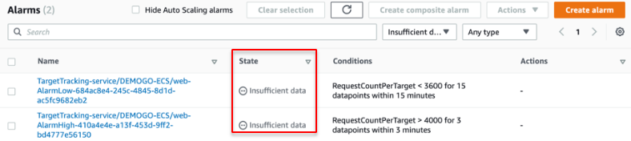
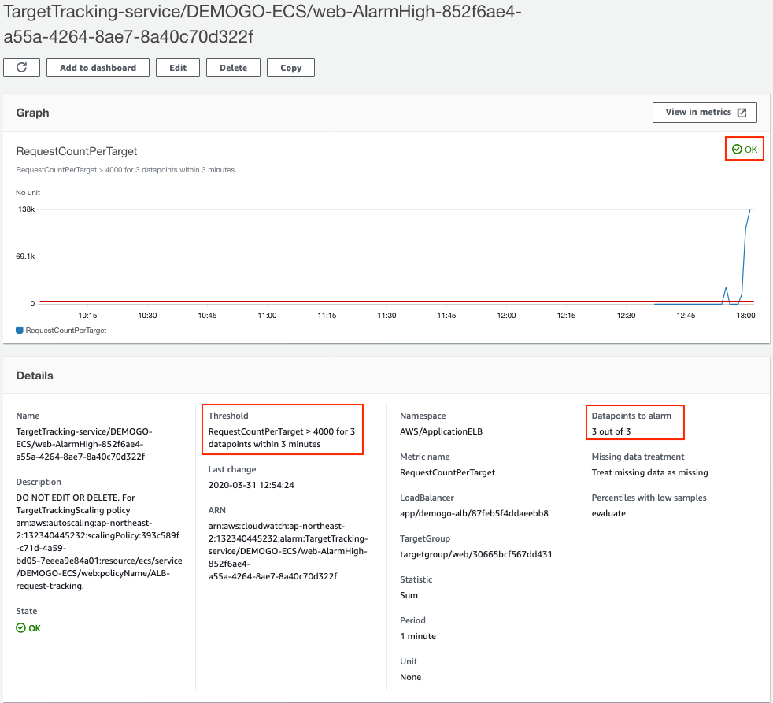
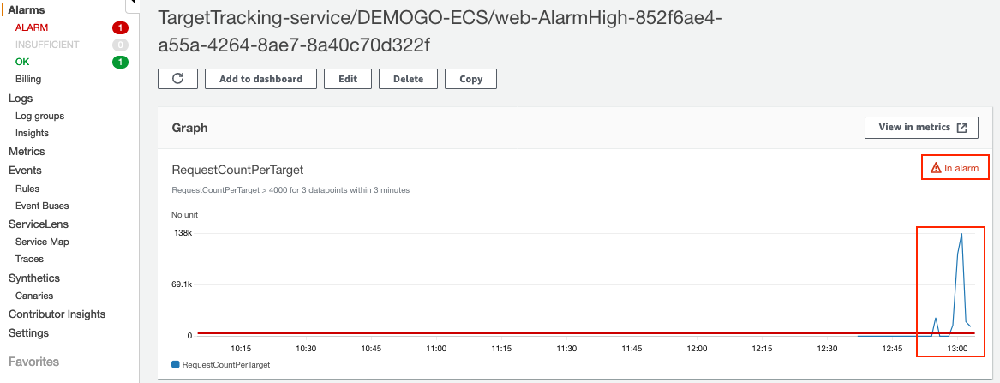
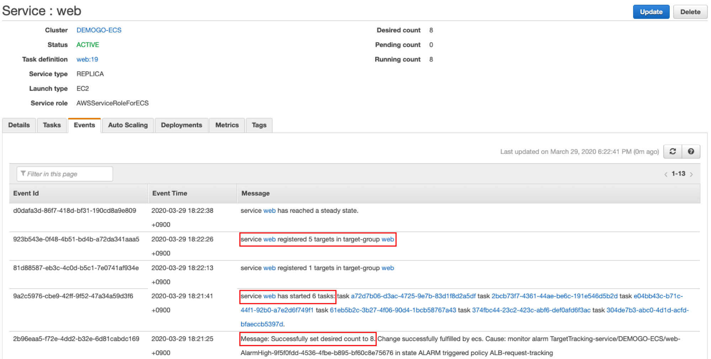
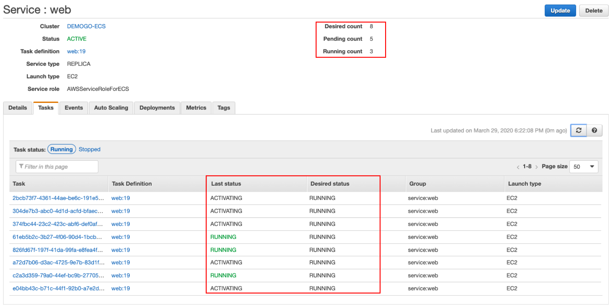
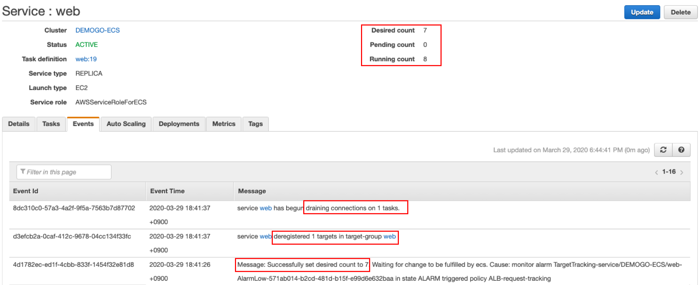

1)	다른 웹 브라우저 탭에 [CloudWatch Alarms](https://ap-northeast-2.console.aws.amazon.com/cloudwatch/home?region=ap-northeast-2#alarmsV2:!alarmStateFilter=ALARM)로 이동합니다. 
2)	처음에는 알람의 상태가 **Insufficient data**일 수도 있습니다.

{}
대상 추적 조정 정책(Target tracking scaling policy)은 지정한 지표에 데이터가 부족할 때(예: 네트워크 연결 문제 등으로 인해) 조정을 수행하지 **않습니다**. 데이터가 부족하다고 해서 사용량이 낮은 것으로 해석하지 않기 때문에 축소 역시 수행하지 않습니다.
{}

3. **Alarm**의 이름을 클릭합니다. 아직 **OK** 상태일 수 있습니다. 빨간색 기준선 **RequestCountPerTarget > 4000**을 초과한 상태를 최소 3분 이상 유지해야 합니다.   

4.	계속해서 **service_loadtest_[실습자이름].sh**을 연속으로 몇 번 더 수행하면 CloudWatch 알람의 상태가 **In alarm**로 바뀌게 됩니다.  

5. **Events**탭에서 서비스 **web**의 상태를 확인합니다. 언제 어떤 이벤트가 발생했는지 알 수 있습니다. 

{}
표 값과 실제 측정치 데이터 포인트 사이에는 차이가 발생할 수 있습니다. Application Auto Scaling이 추가하거나 제거할 용량을 결정할 때마다 항상 반올림 또는 내림을 통해 어림짐작으로 동작하기 때문입니다. 이는 용량을 부족하게 추가하거나 너무 많이 제거하는 일을 방지하기 위해서입니다. 
{}

1. **Tasks** 탭에서 **Desired Count**가 8이 되었음을 알 수 있습니다. 아직 **Activating** 상태인 태스크는 **Desired status**인 **Running**이 될 것입니다. 

1. 시간이 흐른 뒤 서비스는 **desired count**를 조정하여 축소합니다. 결과적으로 서비스 **web**이 **desired count**를 7로 설정했기 때문에 동작 중인 8개 태스크 중 하나를 **종료**할 것입니다. 종료된 태스크는 ALB의 타겟 그룹에서 **등록 해제**됩니다.  

