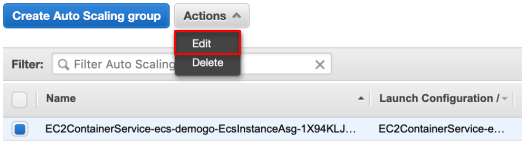

1)	Go to [Amazon EC2 Auto Scaling Groups.](https://ap-northeast-2.console.aws.amazon.com/ec2/autoscaling/home?region=ap-northeast-2#AutoScalingGroups:view=details)

2)	*EC2ContainerService-**your cluster name**-EcsInstanceAsg* and open **Scaling Policies** tab and click **Add policy**.

3)	Configure scaling policy.

* Name: `cluster-as-policy`
* Metric type: Average Network In (Bytes)
* Target value: `50000`
* Instances need: `10` seconds 

{}
We are setting low numbers with an intention to verify the result fast.
{}

1. Click **Create**.
5.	Select *EC2ContainerService-**your cluster name**-EcsInstanceAsg* and click ****Actions** and **Edit** 

1.	Configure ASG. Leave others default.
    * Min: `2`
    * Max: `4`
    * default cooldown: `10` 

1.	Click **Save**.