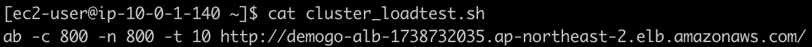
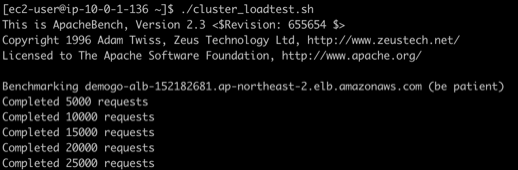

1.	**Workstation** 인스턴스에 접속합니다. 
~~~
$ ssh -i [key pair name.pem] ec2-user@[Workstation Public IP]
~~~

2.  예시로 넣어둔 **cluster_loadtest.sh**의 내용을 살펴봅니다.

~~~
$ cat cluster_loadtest.sh
~~~

3. vi 편집기를 이용해 URL을 **demogo-alb**의 DNS 이름으로 대체한 **cluster_loadtest_실습자이름.sh** 스크립트를 작성하고 권한을 부여합니다. 
~~~
$ vi cluster_loadtest_[실습자이름].sh
~~~

~~~
ab -c 800 -n 800 -t 10 [실습자의 ALB DNS name] + /
ab -c 800 -n 800 -t 10 [실습자의 ALB DNS name] + /cats
ab -c 800 -n 800 -t 10 [실습자의 ALB DNS name] + /dogs
~~~

* :wq!를 눌러 vi 편집을 마칩니다.

~~~
$ chmod 755 cluster_loadtest_[실습자 이름].sh
~~~

1. **cluster_loadtest.sh**를 연속으로 최소 3분 이상 실행하여 부하 테스트를 수행합니다.
~~~ 
$ ./cluster_loadtest_[실습자이름].sh 
~~~
