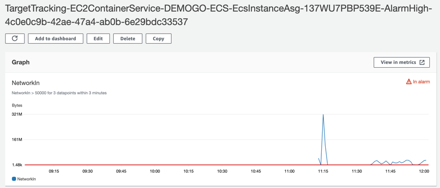
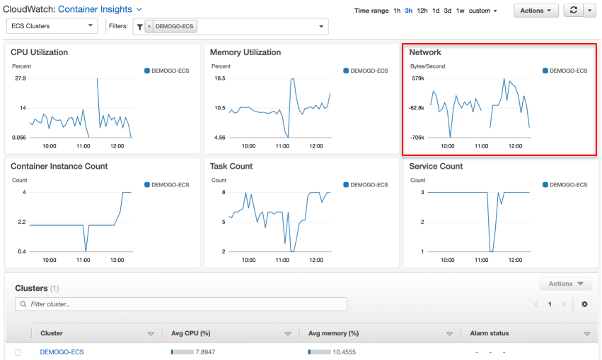

## CloudWatch Alarms
[CloudWatch Alarms](https://ap-northeast-2.console.aws.amazon.com/cloudwatch/home?region=ap-northeast-2#alarmsV2:!alarmStateFilter=ALARM)로 이동합니다.

1. 목표 추적(Target tracking)의 상태가 **Insufficient data**일 수도 있습니다. 목표 추적 조정 정책은 지정한 메트릭의 데이터가 충분하지 않을 때 조정을 수행하지 **않습니다**. 

2. 만약 상태가 **In alarm**으로 바뀌지 않는다면, **Workstation**에서 **cluster_loadtest.sh** 스크립트를 연속으로 몇 번 더 실행합니다. 
~~~
$ ./cluster_loadtest_[실습자 이름].sh 
~~~

3. 알람 이름을 클릭합니다. 빨간색 기준선 **Networking > 50000**을 초과했는지 확인합니다.  

## Amazon ECS
1. [Amazon ECS](https://console.aws.amazon.com/ecs)에서 **ECS Instances** 탭을 열어 살펴봅니다.

6. ECS 인스턴스의 수가 4개가 되었음을 알 수 있습니다. 새로 추가된 인스턴스에는 아직 태스크가 분배되지 않았습니다. 

1. 만약 새로 시작하는 태스크가 있다면 ECS는 태스크가 적은 인스턴스에 태스크를 분배합니다. 

## 모니터링 복습
1. **Metrics** 탭으로 이동합니다. 기본적인 지표들을 확인할 수 있습니다. **View Container Insights**를 누르면 **CloudWatch Container Insight**로 이동하게 됩니다. 

1. Container Insights는 ECS 클러스터의 보다 상세한 정보를 보여줍니다. ECS 클러스터의 조정 트리거로 설정한 네트워크 트래픽(bytes/second) 지표도 확인할 수 있습니다. 마우스를 그래프 위에 올려두면 특정 시점의 수치를 확인할 수 있습니다.  

