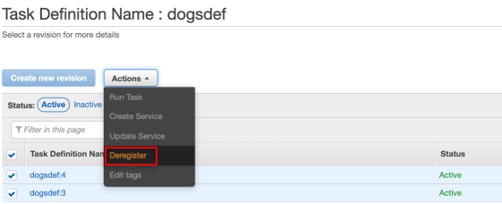
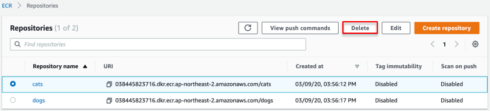
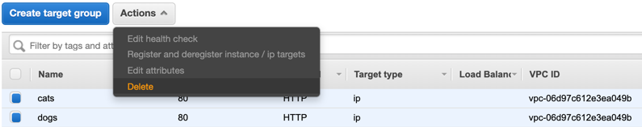
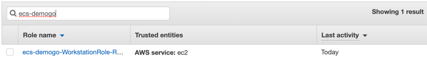
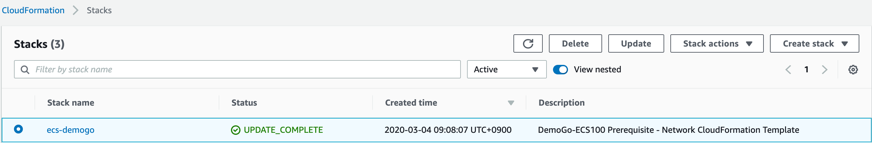
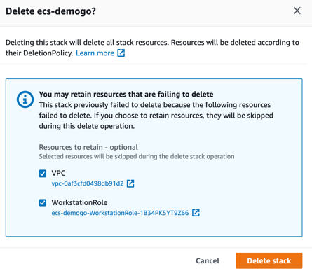
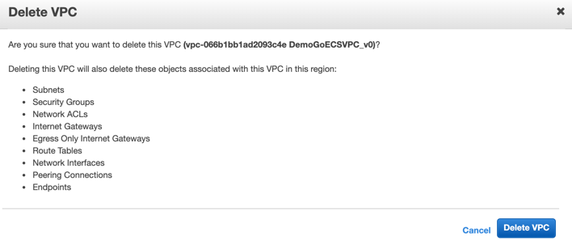
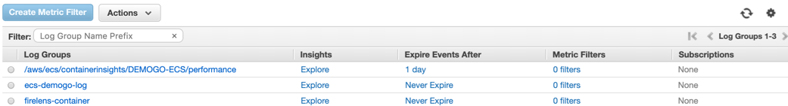

1.	Move to [ECS](https://console.aws.amazon.com/ecs) Clusters and delete **DEMOGO-ECS** cluster.

2.	Move to [ECS](https://console.aws.amazon.com/ecs) Task Definitions and click each **catsdef** and **dogsdef**. Select all and click **Actions**, **deregister**.

3.	Move to [ECR](https://console.aws.amazon.com/ecr) Repositories and delete **cats** and **dogs**

4.	Move to [EC2](https://console.aws.amazon.com/ec2) Load Balancer and delete **demogo-alb.**

5.	Delete target group **web**, **cats** and **dogs.**

6.	Move to [IAM](https://console.aws.amazon.com/iam) role and filter **ecs-demogo** and delete. 

7.	Move to [CloudFormation](https://console.aws.amazon.com/cloudformation) and delete **ecs-demogo** stack. 

8.	Select all resources that are failing to delete, if you have any. 

9.	Move to [VPC](https://console.aws.amazon.com/vpc) and delete **DemoGoECSVPC** manually. 

10.	Move to [CloudWatch](https://console.aws.amazon.com/cloudwatch) Log groups and delete **/aws/ecs/containerinsights/DEMOGO-ECS/performance**, **ecs-demogo-log** and **firelens-container**.

